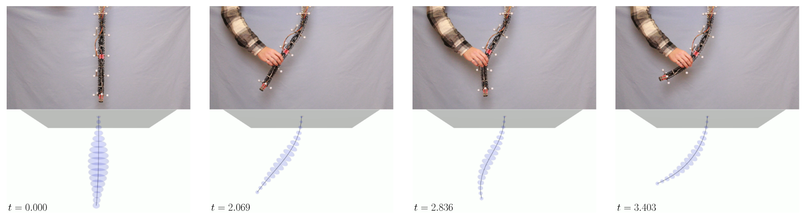
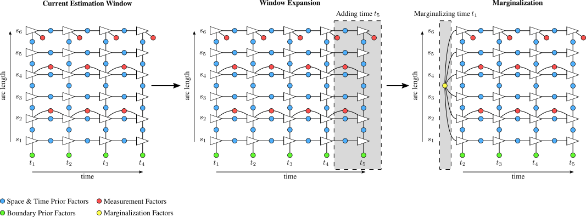

<div align="center">


<h1>Space-Time Continuum</h1>

<p>
A continuous-time-and-space state estimation framework for real-time dynamic state estimation of continuum robots.
</p>
  
<h4>
    <a href="https://arxiv.org/src/2510.26623v1/anc/results_video.mp4">View Demo</a>
    <span> · </span>
    <a href="https://github.com/utiasASRL/space_time_continuum/blob/main/CHANGELOG.md">See Changes</a>
    <span> · </span>
    <a href="https://github.com/utiasASRL/space_time_continuum/issues">Report Bug</a>
    <span> · </span>
    <a href="https://github.com/utiasASRL/space_time_continuum/issues">Request Feature</a>
</h4>

</div>

<br />

📕 <a href="https://arxiv.org/abs/2510.01381">A Stochastic Framework for Continuous-Time State Estimation of Continuum Robots</a>

📕 <a href="https://arxiv.org/abs/2510.26623">A Sliding-Window Filter for Online Continuous-Time Continuum Robot State Estimation</a>

📕 <a href="https://arxiv.org/abs/2602.07209">Continuum Robot Localization using Distributed Time-of-Flight Sensors</a>

<br>

<!-- Table of Contents -->
# Table of Contents

- [About](#about)
- [Getting Started](#getting-started)
  - [Prerequisites](#prerequisites)
  - [Installation](#installation)
  - [Running Demos](#running-demos)
- [Contributing](#contributing)
- [FAQ](#faq)
- [Publications](#publications)
- [Contact](#contact)
- [Acknowledgements](#acknowledgements)
- [License](#license)

<br>

## About

Space-Time Continuum is a continuous-time-and-space estimator for real-time estimation of continuum robots. It achieves real-time runtime with performance that is competitive with state-of-the-art estimation methods. The full breakdown of the theory behind this work, along with details on how to cite this package, can be found in works cited in the [publications](#publications) section. This project remains active with further releases expected in the coming months and years.

### Technical Description

The estimation framework proposed uses a maximum a posteriori (MAP) framework solved via factor-graph optimization. A series of prior factors are proposed which approximate the spatial and temporal dynamics of a Cosserat rod. Three individual solver types are implemented: batch, filter, and sliding-window filter estimators. The two filter-based solvers use an expanding / marginalizing approach to factor-graph construction highlighted in the figure below.



The batch solver cannot grow in size nor does it support marginalization, but rather, performs estimation over a fixed time period. As the estimator is formulated through a factor-graph, it is easy for users to add their own custom factors to integrate sensors and measurement models that are not initially included in this package. If you write a measurement factor for your own work that you feel would be valuable for other researchers, feel free to open a pull request and we can see about adding it to the repository! For more information, see the [contributing](#contributing) sections. For a complete description of the implementation, please see our [publications](#publications).

### When to Use Each Solver

| Scenario / Requirement | Batch                                                                                                                        | Filter                                  | Sliding Window Filter                                                                                    |
|------------------------|------------------------------------------------------------------------------------------------------------------------------|-----------------------------------------|----------------------------------------------------------------------------------------------------------|
| Best for               | Offline problems with short durations that use sensors that are robust to local minima (e.g. FBGS, electromagnetic trackers) | Compute limited, real-time applications | Real-time applications using sensors that are susceptible to local minima (e.g. time-of-flight, cameras) |
| Computational cost     | High                                                                                                                         | Low                                     | Medium-Low depending on window size                                                                      |
| Accuracy               | Highest provided a convex problem. Susceptible to local minima                                                               | Lowest                                  | Good                                                                                                     |

<br>

## Getting Started

This project has been developed and tested in Ubuntu 24.04 LTS. Other Linux distributions are expected to also work, though Windows and MacOS are not.

### Prerequisites

This repository relies on several third party packages listed below that each need to be installed prior to use. The versions numbers provided are the ones this work has been tested and developed with, small variations to version numbers may still work but remain untested.

- [Cmake](https://cmake.org/)
- [Eigen 3.4](https://libeigen.gitlab.io/)
- [VTK 9.3](https://vtk.org/)
- [Qt 6.8.0](https://contribute.qt-project.org/)
- [lgmath](https://github.com/utiasASRL/lgmath) *Note: This dependency will switch to GTSAM in the next version*
- [robin-map](https://github.com/Tessil/robin-map)

### Installation 

```bash
git clone https://github.com/utiasASRL/space_time_continuum 
cd space_time_continuum
./build_release.sh 
```
<!-- 
To run the unit tests, 

```bash
./run_tests
``` -->

### Running Demos

To run paper demos, use the following

```bash
./run_demo <estimator> <robot_number> <trial>
```

Where \<estimator> is one of either "batch", "window", or "filter". \<robot_number> specifies which robot configurations to use (either 1 or 2). \<trial> refers to a specific trial from one of the publications. See below for more information.

<details>
<summary> Trial information </summary>

Four robots are used in the following trials. Their descriptions are as follows:

| Robot number | Used in papers | Description                                                                                     |
|--------------|----------------|-------------------------------------------------------------------------------------------------|
| 1            | [1], [2]       | A simulated extensible continuum robot with four distributed pose sensors. The robot is fixed at the base. The robot is 1 unit long. |
| 2            | [1], [2]       | A real, non-extensible, two segment tendon-driven continuum robot (TDCR) with a pose sensor at its tip. The robot is fixed at the base. The robot has a nitinol backbone, 3D printed stiffening units, and is 46.6cm long. |
<!-- | 3            | [3]            | A simulated, non-extensible, three segment TDCR. The robot has a strain sensor every 3cm, and a ring of 3 time-of-flight sensors radially mounted every 30cm. Each ring also has a gyroscope sensor. The tip additionally has ToF sensor pointing forwards. The robot is 1.5m long and has an insertion degree of freedom at its base, allowing for motion in the x direction. |
| 4 | [3] | A real, extensible, three segment 3D printed TDCR. The robot has three sensor rings, each equipped with three radially mounted ToF sensors and an IMU. The robot is fixed at the base and is 53cm long in its resting position. |   -->

| Trial name    | Used in papers | Robot number | Description |
|---------------|----------------|-------------|---|
| extensible    | [1], [2]       | 1 | A trajectory where the robot begins completed contracted, extends to full length, and then contracts fully again. |
| out_of_bounds | [1], [2]       | 2 | A trajectory where the pose sensor data drops out periodically when the robot moves out of the sensor's range. |
| fast_contact  | [1], [2]       | 2 | A trajectory where aggressive external forces are applied. The robot is periodically grabbed and shaken by the operator, applying sustained external forces. | 
| impulse_1 | [1], [2] | 2 | A trajectory where aggressive external forces are applied. The robot is periodically hit by the operator, inducing abrupt external laods. |
| impulse_2 | [1], [2] | 2 | A trajectory where aggressive external forces are applied. The robot is periodically hit by the operator, inducing abrupt external laods. |
| slow_free_space | [1], [2] | 2 | A trajectory where the robot is actuated with no external loads applied, slowly moving through the workspace. | 
<!-- | engine_inpsection_1 | [3] | 3 | One of three trajectories that have the robot moving into and around a simulated jet engine inspection environment. |
| engine_inpsection_2 | [3] | 3 | |
| engine_inpsection_3 | [3] | 3 | | -->

**Notes:**

- Demos for [3] to be added at a later time.
- Small changes have been made to the code base and configurations that have resulted in small deviations in the results from the original published works. The conclusions of each work remain unchanged. Older versions of the project that have been used in each of the works can be made available upon request, though as with many early research projects, user-friendliness was not a priority at the time and I strongly recommend using the current version.

</details>

<br>

## Contributing

We are open to contribution from third parties! Please use the following

### Adding a new measurement factor type

*Note: This will be deprecated in the next version as we switch to a GTSAM backend*

If you have developed a new measurement factor that you think others would find useful, feel free to open a pull request including the new factor! To make a new factor, it must inherit the ``Spacetime::Factors::MeasurementFactor`` class. The mandatory functions ``getError`` and ``getJacobian`` must be implemented. Please see existing measurement factors and [this example](examples/custom_factor) for reference. In your pull request please include:

- The factor implemented in a single include/spacetime/factors/\<factorname\>.hpp file
- A description at the top of the file of what this factor is for. Include any specific requirements on the data format, hardware, etc.
- \[Optional\] Information at the top of the file of how to cite you

### Other contributions 

Please [open an issue](https://github.com/utiasASRL/space_time_continuum/issues) to raise collaboration ideas and feature requests.

<br>

## FAQ

<details>
<summary><strong>Who is this project for?</strong></summary>

The project in its current state remains research focused. It is meant for individuals who are working in state estimation or otherwise need a stochastic state estimator in their work. I am working to make it more usable beyond the provided demos, and hope to some day have it be a tool that can be easily deployed on other research setups.

</details>

<details>
<summary><strong>Is this code production-ready?</strong></summary>

This code has been used and tested in a research environment. While the system is fast enough to run in real-time, an online API is not currently provided and is left to future work. Caution is advised for researchers wishing to use this repository in any closed-loop control applications, as no formal safety guarantees are currently implemented. If you are a researcher and looking to use it in such an application, feel free to reach out to see if a collaboration is possible.

</details>

<details>
<summary><strong>How do I cite this work?</strong></summary>

See the [Publications](#publications) section of this README.

</details>

<details>
<summary><strong>I found a bug — what should I do?</strong></summary>

Please open an issue:
https://github.com/utiasASRL/space_time_continuum/issues

</details>


<br> 

## Publications

If you find this repository useful in your work, please consider citing the contributions that have made this repository possible.

---

### 📕 [1] A Stochastic Framework for Continuous-Time State Estimation of Continuum Robots

**Spencer Teetaert, Sven Lilge, Jessica Burgner-Kahrs, and Timothy D. Barfoot (2025)**

❓ This is the seminal work, introducing the batch estimation framework implemented in this repository. 

🔗 [https://arxiv.org/abs/2510.01381](https://arxiv.org/abs/2510.01381)


<details>
<summary>Abstract</summary>
State estimation techniques for continuum robots (CRs) typically involve using computationally complex dynamic models, simplistic shape approximations, or are limited to quasi-static methods. These limitations can be sensitive to unmodelled disturbances acting on the robot. Inspired by a factor-graph optimization paradigm, this work introduces a continuous-time stochastic state estimation framework for continuum robots. We introduce factors based on continuous-time kinematics that are corrupted by a white noise Gaussian process (GP). By using a simple robot model paired with high-rate sensing, we show adaptability to unmodelled external forces and data dropout. The result contains an estimate of the mean and covariance for the robot's pose, velocity, and strain, each of which can be interpolated continuously in time or space. This same interpolation scheme can be used during estimation, allowing for inclusion of measurements on states that are not explicitly estimated. Our method's inherent sparsity leads to a linear solve complexity with respect to time and interpolation queries in constant time. We demonstrate our method on a CR with gyroscope and pose sensors, highlighting its versatility in real-world systems. 
</details>
<details>
<summary>BibTeX</summary>

```bibtex
@article{Teetaert2025,
  title={A Stochastic Framework for Continuous-Time State Estimation of Continuum Robots}, 
  author={Spencer Teetaert and Sven Lilge and Jessica Burgner-Kahrs and Timothy D. Barfoot},
  year={2025},
  eprint={2510.01381},
  archivePrefix={arXiv}
}
```

</details>

---

### 📕 [2] A Sliding-Window Filter for Online Continuous-Time Continuum Robot State Estimation

**Spencer Teetaert, Sven Lilge, Jessica Burgner-Kahrs, and Timothy D. Barfoot (2025)**

❓ This work extends the project to enable online estimation. It introduces both the filter and sliding window filter, as well as state marginalization. 

🔗 [https://arxiv.org/abs/2510.26623](https://arxiv.org/abs/2510.26623)

<details>
<summary>Abstract</summary>
Stochastic state estimation methods for continuum robots (CRs) often struggle to balance accuracy and computational efficiency. While several recent works have explored sliding-window formulations for CRs, these methods are limited to simplified, discrete-time approximations and do not provide stochastic representations. In contrast, current stochastic filter methods must run at the speed of measurements, limiting their full potential. Recent works in continuous-time estimation techniques for CRs show a principled approach to addressing this runtime constraint, but are currently restricted to offline operation. In this work, we present a sliding-window filter (SWF) for continuous-time state estimation of CRs that improves upon the accuracy of a filter approach while enabling continuous-time methods to operate online, all while running at faster-than-real-time speeds. This represents the first stochastic SWF specifically designed for CRs, providing a promising direction for future research in this area.
</details>
<details>
<summary>BibTeX</summary>

```bibtex
@inproceedings{Teetaert2026a,
  title={A Sliding-Window Filter for Online Continuous-Time Continuum Robot State Estimation}, 
  author={Spencer Teetaert and Sven Lilge and Jessica Burgner-Kahrs and Timothy D. Barfoot},
  booktitle={2026 IEEE 9th International Conference on Soft Robotics (RoboSoft)}, 
  year={2026},
  pubstate={forthcoming}
}
```

</details>

---

### 📕 [3] Continuum Robot Localization using Distributed Time-of-Flight Sensors

**Spencer Teetaert, Giammarco Caroleo, Marco Pontin, Sven Lilge, Jessica Burgner-Kahrs, Timothy D. Barfoot, and Perla Maiolino (2026)**

❓ This work introduces time-of-flight factors to the framework, enabling real-time localization of continuum robots.

🔗 [https://arxiv.org/abs/2602.07209](https://arxiv.org/abs/2602.07209)

<details>
<summary>Abstract</summary>
Localization and mapping of an environment are crucial tasks for any robot operating in unstructured environments. Time-of-flight (ToF) sensors (e.g.,~lidar) have proven useful in mobile robotics, where high-resolution sensors can be used for simultaneous localization and mapping. In soft and continuum robotics, however, these high-resolution sensors are too large for practical use. This, combined with the deformable nature of such robots, has resulted in continuum robot (CR) localization and mapping in unstructured environments being a largely untouched area. In this work, we present a localization technique for CRs that relies on small, low-resolution ToF sensors distributed along the length of the robot. By fusing measurement information with a robot shape prior, we show that accurate localization is possible despite each sensor experiencing frequent degenerate scenarios. We achieve an average localization error of 2.5cm in position and 7.2° in rotation across all experimental conditions with a 53cm long robot. We demonstrate that the results are repeated across multiple environments, in both simulation and real-world experiments, and study robustness in the estimation to deviations in the prior map.
</details>
<details>
<summary>BibTeX</summary>

```bibtex
@inproceedings{Teetaert2026b,
  title={Continuum Robot Localization using Distributed Time-of-Flight Sensors},
  author={Spencer Teetaert and Giammarco Caroleo and Marco Pontin and Sven Lilge and Jessica Burgner-Kahrs and Timothy D. Barfoot and Perla Maiolino},
  booktitle={Proceedings of Robotics: Science and Systems},
  pubstate={forthcoming},
  address={Sydney, Australia},
  month={7},
  year={2026}
}
```

</details>

<br>

## Contact

This project is maintained by Spencer Teetaert  
Affiliation: [Autonomous Space Robotics Lab](http://asrl.utias.utoronto.ca/) and [Continuum Robotics Lab](https://crl.utm.utoronto.ca/), University of Toronto 

- Email: spencer.teetaert@robotics.utias.utoronto.ca
- Website: https://spencerteetaert.github.io/

Bug reports and feature requests should be submitted through GitHub Issues.

<br>

## Acknowledgements 

This project would not be possible without the support of many collaborators, open-source projects, and funding agencies, including:
* The Natural Sciences and Engineering Research Council of Candada (NSERC)
* My co-authors and collaborators, especially Sven Lilge, whose [project](https://github.com/SvenLilge/Continuum-MultiRobot-Estimation) provides the foundation for this work. 
* My colleagues from both CRL and ASRL who have provided feedback and support
* All the projects used in this work that are supported by the open-source community ([Eigen](https://libeigen.gitlab.io/), [VTK](https://vtk.org/), [lgmath](https://github.com/utiasASRL/lgmath), [Qt](https://contribute.qt-project.org/))

<br>

## License 

This project is freely distributed under the MIT license. Please refer to [LICENSE](LICENSE) for more information.
